# GsmGuard
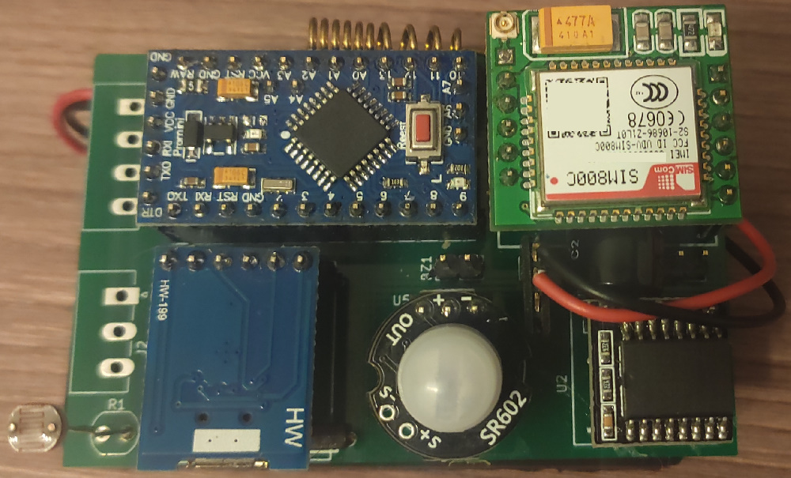
A compact multi-purpose all-in-one open source GSM alarm system.
Build on the base of Arduino Pro Mini and Arduino-compatible modules.


## Features
### Communication
The device sends an SMS on any alarm event and optionally a status report once a day.
Why SMS and not internet service? SMS stays most reliable means of mobile communication in cases of poor signal quality, requires less energy and works directly without relying on central server (which needs to be maintained by someone and may present a security  problem).

Example of an alarm SMS:
```
04.11.19 22:37
Movement detected
```
Example of a daily report SMS:
```
door: Closed [04.11.19 09:14] <-- date and time of last door open event
move: None [04.11.19 09:12] <-- date and time of last movement detection event
temp.: 28*C [min. 21*C, max. 28*C, mean 27*C] <-- current temperature and temperature statistics for the current day
light: 99% <-- current illumination level (0 to 100%)
bat.: 4.6v <-- current battery voltage
ext.1: 0 <-- current state of external sensor 1
ext.2: 0 <-- current state of external sensor 2
```

For every alarm event you can also enable a call to your phone or/and sound alarm.

### Sensors

- Door open sensor (magnetic reed switch)
- Illumination level sensor (photoresistor)
- Motion sensor (PIR sensor)
- Temperature sensor (built-in DS3231)

### Alarm events
- Open door
- Rapid illumination change
- Motion detection
- Too high or too low temperature
- Low battery voltage

### Power supply
Three AA batteries. Expected lifetime: 3 to 6 months.

### Configuration and logging
The device can be connected to a PC via USB for configuration.
Configuration program lets you set target phone number, time of daily SMS report, choose events that will be reported, a way of notification (SMS, call, sound alarm) and set time periods during which those events are being monitored. I.e. if you know that the room is being used during some hours in certain days of the week, you can disable the alarm for that period.
It also shows the last 70 events with date and time and a temperature plot for the last 31 days (one measurement every 2 hours).

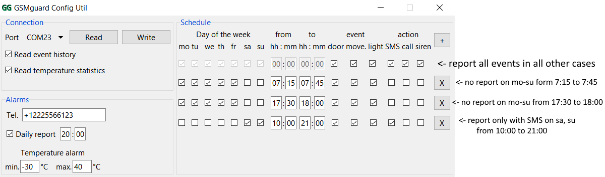

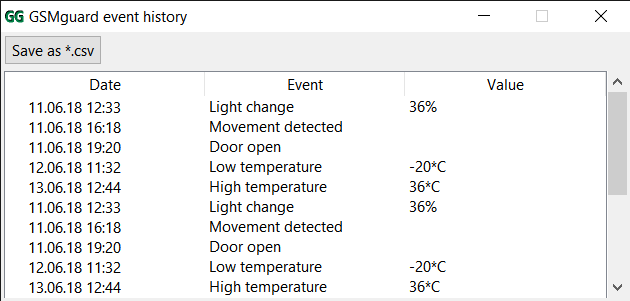

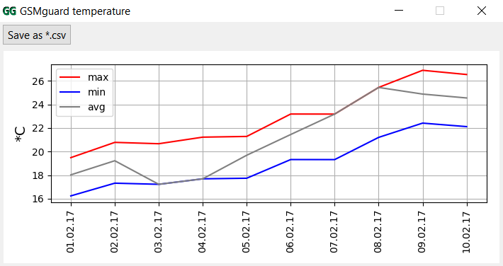

### Localization

Currently supported languages (SMS and configuration program for PC): English, Russian.

Date format: dd/mm/yy

Temperature units: degrees Celsius

## Assembling guide
### Hardware
#### List of components

List of Arduino modules you will need:

- Arduino Pro Mini 3.3v 8MHz (5v 16MHz is also acceptable, but requires different firmware) 

  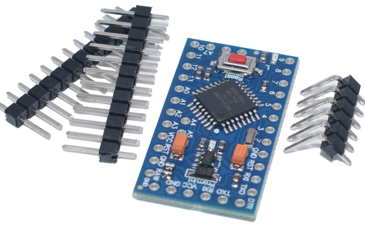

-  MH-SR602 MINI Motion Sensor 

  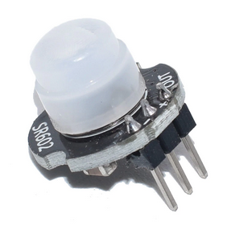

-  SIM800C(L) GSM Module 

  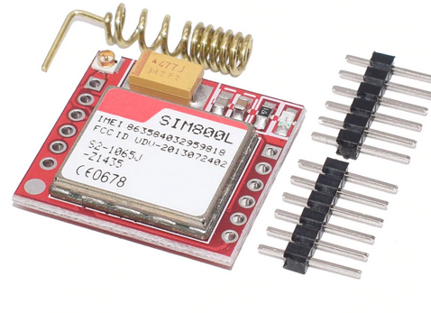

-  CP2102 MICRO USB to UART TTL Module

  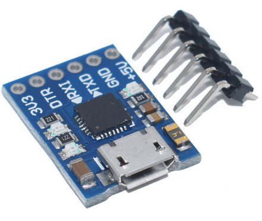

-  DS3231 RTC Module For Raspberry Pi 

  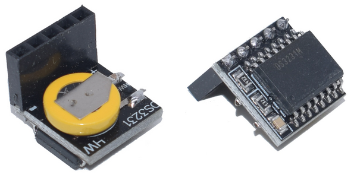

Other components

- any >0.5A logic-level P-channel MOSFET in SOT-23

- reed switch

  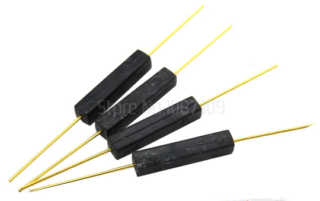

- buzzer 3 to 5v

  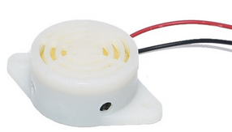

- electret microphone

- photoresistor

  

- resistors, capacitors 

The schematics:

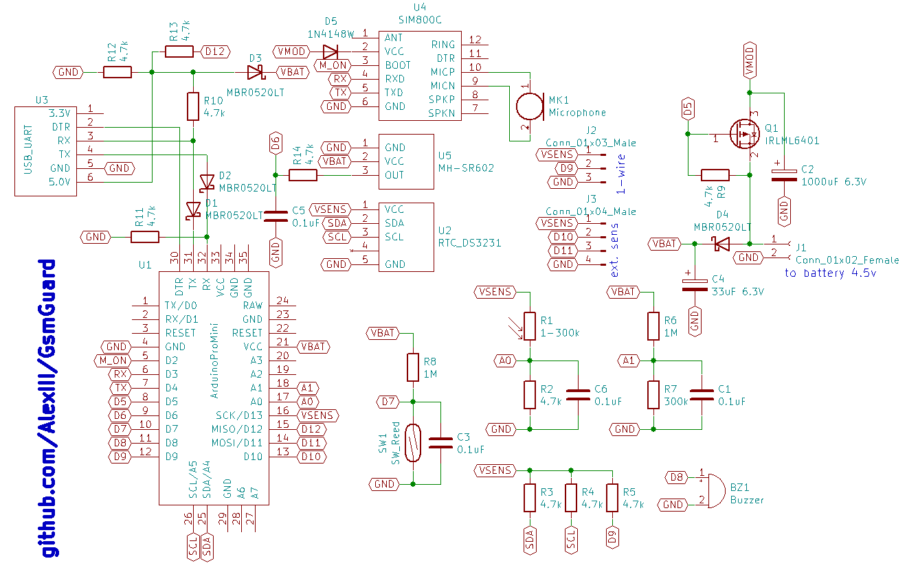


#### Important Note
Remove power LED or the resistor that goes in series with it from the Arduino board. Otherwise it will drain the batteries in a matter of few days. It is better to remove voltage regulator IC from the Arduino too, as it's not being used but still draws a little bit of current.
#### Giving out PCBs
I have 9 leftover PCBs of the first iteration that I can send via mail (for free). It's a first version, so it has some errors which you will need to fix with a cutter and a few jump wires. If you interested write me to 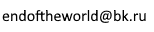

### Software

#### Flashing Arduino

You can upload precompiled `*.hex` firmware to Arduino via [xLoader](http://www.hobbytronics.co.uk/arduino-xloader). There's four firmware files available:

| hex file                       | description                |
| ------------------------------ | -------------------------- |
| gsmGuard-firmware-EN-8MHz.hex  | 8MHz arduino, english SMS  |
| gsmGuard-firmware-EN-16MHz.hex | 16MHz arduino, english SMS |
| gsmGuard-firmware-RU-8MHz.hex  | 8MHz arduino, russian SMS  |
| gsmGuard-firmware-RU-16MHz.hex | 16MHz arduino, russian SMS |


#### Running configuration program

- Windows 

  Run gsmGuardConf_v1.0.exe. It requires no installation, but the unpacking process is rather slow, it may take 10-20 seconds to run.

- Linux

  `~$ python2.7 gsmGuardConf.py`

## Usage notes
- The device pauses its normal operation when it's connected to USB.
- If the device failed to send an SMS, it will try again in 2 minutes, then again in 5, in 10, in 20, twice in 40 and then every 12 hours.
- After a successful call the device will hang-up in 3 minutes.
- The sound alarm will be on for 30 seconds.
- Door, movement and light change events are not monitored for 20 minutes after the last reported event.
- If the device's power was turned off for three hours, the temperature history gets erased.

## Known issues
It looks like PIR sensors perform badly in cold temperature. Mine starts losing stability (frequent false tripping) when ambient temperature drops below +5 Celsius.  I'm sure it havely depends on the particular model, though.

## Project files
- /config-util - PC configuration program. Python 2.7 + Tk + pyserial + matplotlib
- /gsmGuard-firmware - Arduino firmware. In order to successfully compile it, some manual tweaks to Arduino IDE is needed: 
  1. Manually install RTCLib (clone the repo, or use release that LATER than 1.5.6 if there's one): https://github.com/NeiroNx/RTCLib
  2. Go to your Arduino IDE installation directory, find file `Arduino/hardware/arduino/avr/platform.txt`. Change `-std=gnu++11` to `-std=c++17`.
  3. Go to `Arduino/hardware/arduino/avr/cores/arduino/Stream.h`. Add line `public:` before the line `struct MultiTarget {`.
  4. Go to `Arduino/hardware/arduino/avr/cores/arduino/Stream.h`. Change <u>second</u> entry `#define SERIAL_RX_BUFFER_SIZE 64` to `#define SERIAL_RX_BUFFER_SIZE 256`
- /kicad-project - KiCAD schematics and board

## License

MIT License © github.com/AlexIII
